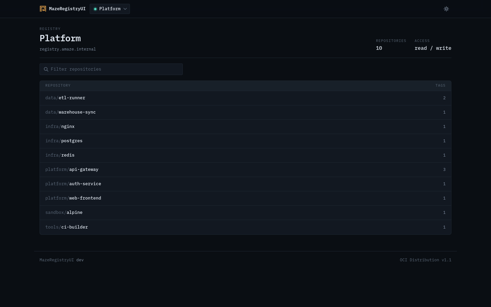
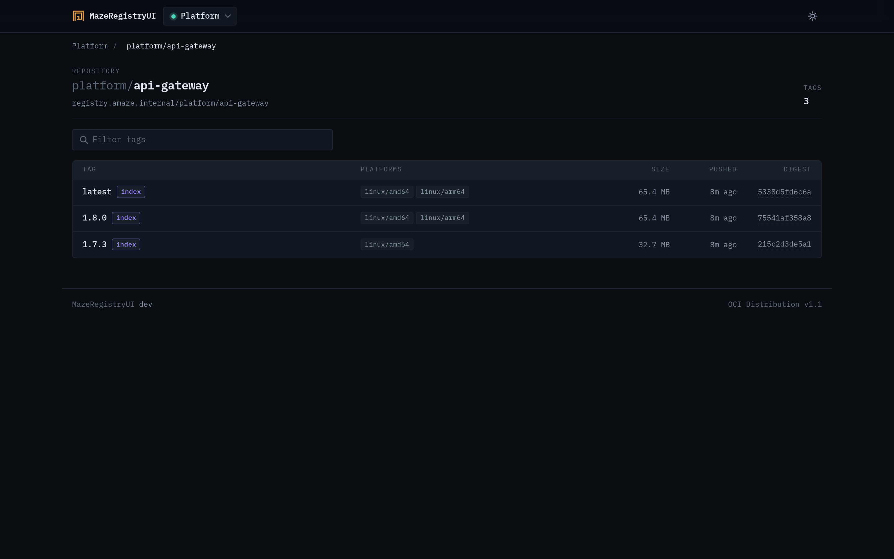
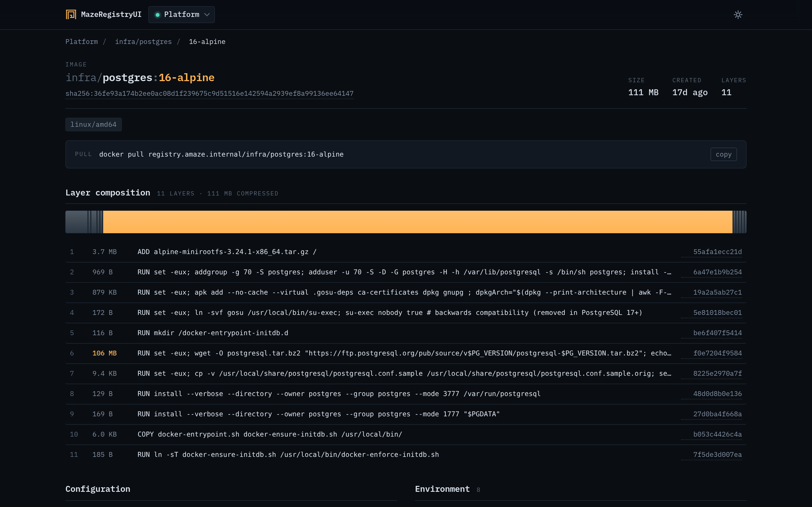
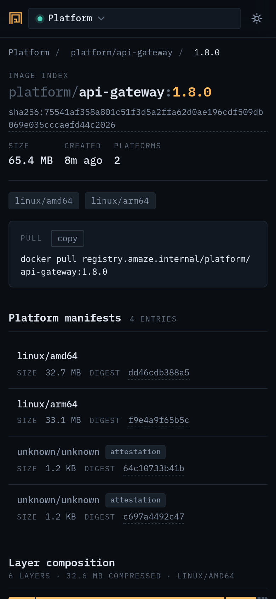
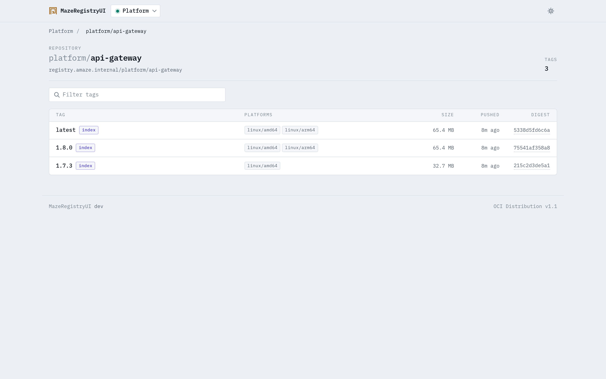
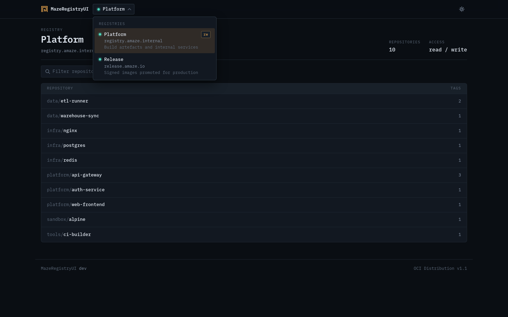

# MazeRegistryUI

A single-binary, server-rendered web UI for browsing OCI and Docker registries.

[](https://github.com/amaze-labs/MazeRegistryUI/actions/workflows/ci.yml)
[](https://go.dev/dl/)
[](LICENSE)
[](https://github.com/amaze-labs/MazeRegistryUI/pkgs/container/mazeregistryui)

MazeRegistryUI exists because the common alternative, `joxit/docker-registry-ui`,
is a JavaScript single-page app that ships a large bundle to the browser and
talks to the registry from there. This one renders HTML on the server and uses
HTMX for the few interactive parts, so the page is useful before any script
runs and works on a phone. The browser never contacts a registry: every call is
proxied by the backend, which keeps credentials server-side and removes the
need for CORS configuration on the registry. One binary, one config file, and a
header picker for as many registries as you list.

It speaks the OCI Distribution Specification v1.1, as served by Distribution
3.x, Harbor, GHCR, Gitea and others. Legacy Docker manifest schema 1 is
rejected on purpose.

## Screenshots

<p align="center">
  
</p>

<table>
  <tr>
    <td width="50%"></td>
    <td width="50%"></td>
  </tr>
  <tr>
    <td align="center"><em>Repository — tags load as they scroll into view</em></td>
    <td align="center"><em>Image — layer composition, config and raw manifest</em></td>
  </tr>
  <tr>
    <td width="50%"></td>
    <td width="50%"></td>
  </tr>
  <tr>
    <td align="center"><em>Mobile layout</em></td>
    <td align="center"><em>Light theme</em></td>
  </tr>
</table>

<p align="center">
  
  <br><em>Every configured registry in one place, with a live reachability check</em>
</p>

## Features

- Multiple registries in one instance, switched from a picker in the header,
  each with its own credentials, timeouts and permissions.
- Catalog with instant in-memory search; the full repository list is indexed
  server-side, so filtering does not re-walk the registry.
- Tag rows that resolve lazily as they scroll into view, bounded by a
  per-registry concurrency limit.
- Image detail: proportional layer composition bar with the three largest
  layers highlighted, the build command behind each layer, labels, environment,
  config, annotations and the raw manifest.
- Multi-architecture indexes: every child manifest is listed with its platform,
  and shared layers are counted once in the total size.
- Copyable `docker pull` command, with an overridable pull hostname.
- Manifest deletion, opt-in per registry.
- Auth: anonymous, HTTP basic, a static bearer token, and the automatic bearer
  token-service handshake (Harbor, GHCR, Gitea, htpasswd-protected
  Distribution).
- Dark and light themes, remembered per visitor.
- `/healthz` endpoint, structured logs (text or JSON), graceful shutdown.
- No CDN, no Node build step: templates, CSS, IBM Plex Mono and HTMX are
  embedded in the binary, so it runs air-gapped.

## Quickstart

### Docker Compose (fastest, includes a demo registry)

```bash
git clone https://github.com/amaze-labs/MazeRegistryUI.git
cd MazeRegistryUI
$EDITOR deploy/config.yaml     # point it at your registries
docker compose up -d
```

Open <http://localhost:8080>. The bundled stack starts a throwaway
Distribution 3 registry alongside the UI, so there is something to look at
before you change anything. `docker compose down -v` removes both.

### Docker, against a registry you already run

Write a `config.yaml`:

```yaml
server:
  addr: ":8080"

ui:
  title: Registry

registries:
  - id: local
    name: Local registry
    url: http://registry.internal:5000
    auth:
      type: none
```

Then:

```bash
docker run -d --name mazeregistryui \
  -p 8080:8080 \
  -v "$PWD/config.yaml:/etc/mazeregistryui/config.yaml:ro" \
  --read-only --tmpfs /tmp:size=16m \
  --cap-drop ALL --security-opt no-new-privileges:true \
  ghcr.io/amaze-labs/mazeregistryui:latest
```

The image runs as uid 65532 and reads `/etc/mazeregistryui/config.yaml` by
default. See [docs/DEPLOYMENT.md](docs/DEPLOYMENT.md) for Kubernetes, reverse
proxies and TLS.

### From source

```bash
make build                                  # -> bin/mazeregistryui
./bin/mazeregistryui -config config.yaml
```

Requires Go 1.25 or newer and nothing else. Useful flags:

```bash
./bin/mazeregistryui -config config.yaml -check   # validate the config and exit
./bin/mazeregistryui -version
```

## Configuration at a glance

Configuration is file-only: registries cannot be added from the UI, so the file
is the complete list of what is browsable.

| Key | Default | What it does |
| --- | --- | --- |
| `server.addr` | `:8080` | Listen address. |
| `server.base_path` | *(none)* | Serve under a sub-path, e.g. `/registry`. |
| `server.access_log` | `false` | One structured log line per request. |
| `ui.title` | `MazeRegistryUI` | Name in the header and page titles. |
| `ui.theme` | `auto` | `auto`, `dark` or `light`; visitors can override. |
| `ui.show_pull_command` | `false` | Render a copyable `docker pull` command. |
| `registries[].id` | derived from `name` | Identifier used in URLs. |
| `registries[].url` | *(required)* | Registry root — **without** the `/v2` suffix. |
| `registries[].auth.type` | `none` | `none`, `basic` or `bearer`. |
| `registries[].delete_enabled` | `false` | Expose manifest deletion for this registry. |
| `registries[].cache_ttl` | `60s` | How long tag-addressed data is reused. |

Secrets stay out of the file with `${VAR}` / `${VAR:-fallback}` expansion or
the `password_env` / `token_env` fields.

Full reference, worked examples and troubleshooting:
**[docs/CONFIGURATION.md](docs/CONFIGURATION.md)**.

## Requirements

- **To run the container:** any OCI runtime. Images are published for
  `linux/amd64` and `linux/arm64`.
- **To build from source:** Go 1.25 or newer. No CGO, no Node, no other
  toolchain.
- **Registries:** anything implementing OCI Distribution Spec v1.1 —
  Distribution 3.x, Harbor, GHCR, Gitea, Zot, Artifactory. Registries that only
  serve Docker manifest schema 1 are not supported.
- Deletion additionally needs the registry itself started with storage deletion
  enabled (`REGISTRY_STORAGE_DELETE_ENABLED=true` for Distribution).

## Documentation

| Document | Contents |
| --- | --- |
| [docs/CONFIGURATION.md](docs/CONFIGURATION.md) | Every configuration field, worked examples, troubleshooting. |
| [docs/DEPLOYMENT.md](docs/DEPLOYMENT.md) | Docker, Compose, Kubernetes, reverse proxies, releases. |
| [docs/ARCHITECTURE.md](docs/ARCHITECTURE.md) | How it is put together, for people changing the code. |
| [CONTRIBUTING.md](CONTRIBUTING.md) | Development loop and commit conventions. |

## License

MIT — see [LICENSE](LICENSE).
