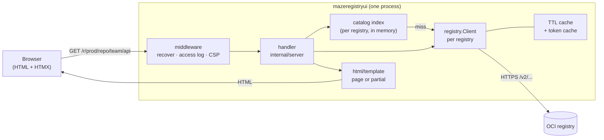

# Architecture

This document is for someone about to change the code. It explains how a
request travels through the program, why the non-obvious decisions were made,
and where each concern lives.

The shape of the thing in one sentence: a Go HTTP server renders HTML from
templates, calling an OCI Distribution client on the way; the browser gets
finished markup and uses HTMX to ask for more fragments of it.

---

## Request path



Step by step, for `GET /r/prod/repo/team/api`:

1. **`Server.routes`** (`internal/server/server.go`) matches the pattern
   `GET /r/{rid}/repo/{repo...}` on a `net/http` `ServeMux`. Go 1.22+ pattern
   matching means there is no router dependency. When `server.base_path` is
   set, an outer mux strips the prefix before this one sees the path.
2. **Middleware**, applied outermost-first: `recoverPanic` → `accessLog` (only
   when enabled) → `securityHeaders` → mux.
3. **`handleRepository`** (`internal/server/handlers.go`) resolves `{rid}` to a
   `config.Registry` and its `registry.Client` via `Server.lookup`, which
   renders a 404 page for an unknown id.
4. **`client.Tags`** fetches one page of tags, through the client's TTL cache.
   The handler builds a `repoPage` of `tagRowView`s — tag name, link, and the
   fragment URL that will later resolve the row's details. No manifest is
   fetched yet.
5. **`Server.render`** executes the `repository` template set into a buffer,
   then writes it. Buffering means a template error becomes a clean 500 instead
   of a half-written page.
6. **In the browser**, each row carries `hx-trigger="revealed once"`. As rows
   scroll into view HTMX issues `GET /x/tag/{rid}/{repo}?t=<tag>`, and
   `handleTagRow` returns just that row's `<li>`, rendered from the same
   partial.

Fragment endpoints live under `/x/` and return partials rather than pages:

| Route | Purpose |
| --- | --- |
| `GET /{$}` | Redirect to the default registry. |
| `GET /r/{rid}` | Catalog page. |
| `GET /r/{rid}/repo/{repo...}` | Repository (tag list). |
| `GET /r/{rid}/image/{repo...}?ref=` | Image detail. |
| `POST /r/{rid}/delete` | Manifest deletion. |
| `GET /x/catalog/{rid}` | Catalog rows — search and "load more". |
| `GET /x/repocount/{rid}/{repo...}` | Tag count badge on a catalog row. |
| `GET /x/tags/{rid}/{repo...}` | The next page of tag rows. |
| `GET /x/tag/{rid}/{repo...}` | One resolved tag row. |
| `GET /x/health/{rid}` | Status dot in the registry picker. |
| `POST /x/theme` | Set the theme cookie, redirect back. |
| `GET /healthz` | Liveness/readiness JSON. |
| `GET /static/` | Embedded assets. |

---

## Why the server proxies every registry call

The browser never sends a request to a registry. Everything goes through the
backend. Three reasons, in order of importance:

1. **Credentials stay server-side.** A registry that needs basic auth or a
   token needs those credentials on whoever calls it. A JavaScript client would
   need them in the browser — which means shipping them to every visitor. Here
   they exist only in the server's memory, loaded from the config file, and are
   never rendered into a page.
2. **No CORS.** A browser calling a registry directly needs that registry to
   send permissive CORS headers, which means reconfiguring — and weakening —
   every registry you want to browse. Nothing here requires touching a registry
   at all; read access is enough.
3. **Caching and coordination.** One process in front of a registry can
   deduplicate, cache and rate-limit for all its users. A hundred browsers
   cannot coordinate with each other; one server can, and does — see the two
   caches and the concurrency limiter below.

A fourth, smaller reason: it keeps the client-side code small enough that the
whole UI works as plain HTML, with HTMX adding progressive enhancement rather
than being load-bearing.

---

## Caching

There are two independent caches, at different layers, answering different
questions.

### 1. The client TTL cache — `internal/registry/cache.go`

One per registry, bounded (2048 entries), LRU with per-entry expiry, no
background goroutine (expiry is enforced lazily on read and on write, so a
client can be created and dropped without leaking anything).

What lives in it, and for how long:

| Key | Scope | TTL | Why |
| --- | --- | --- | --- |
| `manifest\|<repo>\|<digest>` | repo | 1 hour | Digest-addressed content is immutable by definition. If the bytes changed, the digest would too. |
| `manifest\|<repo>\|<tag>` | repo | `cache_ttl` (60s) | A tag can be moved at any time. |
| `blob\|<repo>\|<digest>` | repo | 1 hour | Config blobs only; immutable, same argument. |
| `catalog\|<n>\|<last>` | global | `cache_ttl` | Repositories come and go. |
| `tags\|<repo>\|<n>\|<last>` | repo | `cache_ttl` | Tags come and go. |

The immutable/mutable split is the whole point. Fetching a tag also stores the
same bytes under the digest key with the one-hour TTL, because index children
and repeated views resolve through that key. In a repository whose tags share
base layers — which is to say, nearly all of them — the first row pays for the
blobs and every later row hits the cache.

Entries carry the repository they belong to. `InvalidateRepo(repo)` after a
deletion drops that repository's entries **and** all global ones, because
deleting a repository's last tag can make it vanish from the catalog too.

Values are handed out by reference, so anything stored must be treated as
immutable by readers. `CatalogPage` and `TagPage` are cloned on the way out and
`RawManifest` is copied, so a handler sorting or filtering what it got cannot
corrupt the cache.

### 2. The catalog index — `internal/server/catalog.go`

The Distribution API has no search endpoint. `/v2/_catalog` is a paginated
list, nothing more. Filtering by walking every page on each keystroke would be
absurd, so the server keeps the **full repository list per registry** in memory,
sorted, refreshed when older than `cache_ttl`.

Search is then `strings.Contains` over a slice: instant, and it supports
multiple whitespace-separated terms as AND ("team backend api"), because that
is how people actually narrow a list.

Two behaviours worth knowing when changing this:

- **A stale list beats an error page.** If a refresh fails but a previous list
  exists, the previous list is served. A registry blipping for thirty seconds
  should not blank the screen.
- **`load sync.Mutex` per entry** means a burst of concurrent requests to a
  cold registry triggers one catalog walk, not one per request.
- The index stops at 50,000 repositories. Larger registries are still
  browsable; the list is simply truncated, which is better than an unbounded
  allocation driven by a remote system.

### The token cache — `internal/registry/auth.go`

A third, small cache: bearer tokens keyed by `(realm, service, scope)`, held
for their advertised lifetime minus ten seconds. Its mutex is deliberately held
across the network call. When a page of tags fans out and every goroutine hits
the same `401` in the same instant, serialising here turns dozens of token
requests into one — and token endpoints are exactly what registries rate-limit.

### The health cache

`healthCache` in `server.go` remembers each registry's reachability for 30
seconds so opening the picker does not re-probe every endpoint. The probes are
also staggered client-side (`HealthDelay`, 120 ms apart) so they do not all
fire in the same millisecond.

---

## Lazy tag rows and the concurrency limit

Resolving one tag row is expensive: fetch the manifest, and if it is an index,
fetch every child manifest, and for each of those the config blob — that is
where creation time, platform and true size come from. Rendering fifty of those
before the first byte of HTML would make a repository page take seconds.

So the repository page renders immediately with fifty placeholder rows, each
carrying `hx-trigger="revealed once"`. A row costs nothing until it scrolls
into view, and rows the user never scrolls to cost nothing at all.

That leaves the opposite risk: a fast scroll firing fifty requests at once, each
fanning out into several manifest fetches. Two limits bound it:

- **`perRegistryConcurrency = 6`** (`server.go`) — a buffered channel per
  registry, acquired by `handleTagRow` and `handleRepoCount`. At most six row
  lookups are in flight against one registry at a time. `Server.acquire`
  honours request cancellation, so a user navigating away releases their slot
  instead of holding it.
- **`maxChildConcurrency = 6`** (`client.go`) — within one index, at most six
  child manifests resolve in parallel.

The limits are per registry, so a slow registry cannot starve the others: each
has its own semaphore, its own HTTP client and its own cache.

A related detail in `resolveChildren`: each goroutine writes only its own slice
element, so there is no lock around the results, and a child that fails to
resolve is left `nil` rather than failing the whole index — one broken platform
should not hide the other five.

---

## Templates

`internal/server/render.go`. Layout:

```
web/
  embed.go              # embed.FS for templates/ and static/
  templates/
    base.html           # the shell: header, picker, breadcrumbs, footer
    catalog.html        # each page defines its own "content" block
    repository.html
    image.html
    error.html
    partials/
      catalog_rows.html # "catalog_rows", "repo_count"
      tag_rows.html     # "tag_rows", "tag_row"
      misc.html         # "banner", "health_dot"
  static/               # app.css, app.js, theme.js, htmx.min.js, icon.svg, fonts/
```

**One template set per page.** Every page defines a block named `content`, so
they cannot coexist in a single `template.Template` — the last one parsed would
win. `parseTemplates` therefore builds one set per page file, each containing
`base.html`, all the partials, and that one page. They are parsed once at
startup; a template error is a startup error, not a runtime surprise.

**A separate `_partials` set** holds only the partials, and `renderPartial`
executes a single named template from it. This is what makes the HTMX endpoints
cheap: `tag_row` is the same definition whether it is rendered inside a full
page or returned as a 200-byte fragment. Partials are written to be
self-contained for exactly that reason — a partial that depends on `base`'s
data would break the moment HTMX asked for it directly.

Template funcs (`templateFuncs`) are deliberately few: `url`/`asset` prepend
`base_path`, `bytes`/`since`/`full`/`short` are the humanisers from
`humanize.go`, and `dict` builds an inline map so a partial can take ad-hoc
arguments. Anything more complicated belongs in the handler, as a view struct.

**Assets** are embedded via `embed.FS` and served under `/static/` with a `?v=`
build token derived from the commit. With the token present they are served
`immutable` for a year; without it, one hour. Since the token changes exactly
when the binary does — which is exactly when the embedded files can have
changed — there is no cache-invalidation problem to manage.

**Client-side JavaScript** is three small files: `htmx.min.js`, `theme.js` (a
pre-paint script that reads the theme cookie so there is no flash of the wrong
theme) and `app.js` (copy buttons, layer bar hover, delete confirmation).
Nothing is fetched from a CDN, which is what lets the whole thing run
air-gapped and what makes the strict CSP below possible.

---

## Security posture

| Control | Where | What it does |
| --- | --- | --- |
| Content-Security-Policy | `middleware.go` | `default-src 'none'` with `'self'` for script, font and connect; `img-src 'self' data:`; `form-action 'self'`; `base-uri 'none'`; `frame-ancestors 'none'`. No external origin at all — affordable precisely because nothing loads from a CDN. `style-src` is `'self'` plus a per-request nonce (`newNonce`, 16 random bytes), carried to the renderer on the request context and exposed to templates as `Layout.Nonce`. |
| `X-Content-Type-Options: nosniff`, `X-Frame-Options: DENY`, `Referrer-Policy: same-origin` | `middleware.go` | The usual hardening set. |
| CSRF on deletion | `sameOriginPost` + `Server.csrf` | Deletion is the only state-changing request. It carries a per-process random token in a hidden field, and `Sec-Fetch-Site` must be `same-origin` when the browser sends it. There are no sessions to protect — only cross-site submission of the delete form. |
| Open-redirect protection | `Server.safeReturn` | The theme toggle takes a return path. Anything not starting with a single `/`, or outside `base_path`, is replaced with the default registry page. |
| Path validation | `client.go` | Repository names are validated against the OCI grammar, tags against the tag grammar, digests against `^sha256:[0-9a-f]{64}$` — *before* being interpolated into a URL. Anything the grammar rejects has no business being there, which leaves no room for `..` or a percent-encoded traversal to reach the registry. |
| No credentials in the browser | by construction | Credentials live in the server process. Nothing renders them; `sanitiseURL` strips userinfo from every URL before it reaches a log line or an error message. |
| Credential stripping on redirect | `stripAuthOnHostChange` | Registries redirect blob downloads to object storage. The `Authorization` header is dropped when a redirect crosses hosts, so a registry credential is never handed to a third party. Redirects are capped at 10. |
| Response size limits | `client.go` | Manifests and config blobs 8 MiB, token responses 1 MiB, error documents 64 KiB. A registry is a remote system that can be slow, broken or hostile; nothing is read without a ceiling. |
| Panic isolation | `recoverPanic` | One broken request returns a 500 instead of taking the process down. |
| Errors are translated | `friendlyError` | Known error classes become operator-readable sentences; anything else is passed through, already sanitised. |

Two things it deliberately does **not** do: there is no user authentication
(put an authenticating proxy in front if you need one — see
[DEPLOYMENT.md](DEPLOYMENT.md#authentication-in-front-of-the-ui)), and there is
no write path other than manifest deletion.

---

## Package map

```
cmd/mazeregistryui/main.go   flags, logger construction, signal handling
internal/
  config/                    the config file: schema, defaults, validation
  registry/                  the OCI Distribution v1.1 client
  server/                    HTTP: routing, handlers, view models, rendering
  version/                   build metadata injected with -ldflags
web/                         embedded templates, CSS, fonts, HTMX
```

### `cmd/mazeregistryui`

Thin. Parses four flags (`-config`, `-check`, `-version`, `-log-format`), each
with an environment fallback, loads the config, builds an `slog` logger (text
or JSON, level from `server.log_level`), constructs the server and runs it under
a `signal.NotifyContext` for SIGINT/SIGTERM. `-check` exits after validation,
which is what makes config validation cheap to run in CI or a pre-deploy step.

### `internal/config`

`Load` → `Parse` → expand `${VAR}` → decode YAML with `KnownFields(true)` →
apply defaults → resolve `*_env` secrets → `Validate`.

Three decisions to preserve when editing:

- **Environment expansion happens on the raw text**, before parsing, so a
  `${VAR}` works in any string field rather than in a hand-picked few.
- **An unset variable with no fallback is a startup error.** Silently
  authenticating with an empty password is worse than refusing to start.
- **`Validate` collects every error** with `errors.Join` rather than returning
  the first. An operator fixing a config file should not have to restart once
  per mistake.

### `internal/registry`

The whole OCI client, with no dependency on the server package.

| File | Contents |
| --- | --- |
| `types.go` | The `Client` interface, media types, sentinel errors (`ErrNotFound`, `ErrUnauthorized`, `ErrUnsupported`, `ErrDeleteDenied`) and the display model (`Image`, `Layer`, `TagSummary`, …). |
| `client.go` | HTTP plumbing, path validation, `Catalog`/`Tags`/`Image`/`TagSummary`/`DeleteManifest`/`Blob`, index resolution, `Link`-header pagination, natural tag ordering. |
| `manifest.go` | Decoding OCI image manifests, OCI indexes and their Docker v2 equivalents into one `manifestDoc`; parsing config blobs and zipping history onto layers. Schema 1 media types are recognised only so they can be rejected with `ErrUnsupported`. |
| `auth.go` | `WWW-Authenticate` parsing (a real scanner — the grammar has commas inside quoted scope values, so splitting on commas is always wrong), the token handshake, and the token cache. |
| `cache.go` | The bounded TTL/LRU cache described above. |

Some behaviour that looks like an implementation detail but is a deliberate
product decision:

- **Index sizes count distinct blobs once.** Children of an index overwhelmingly
  share base layers; summing per platform would inflate the total several-fold.
- **The digest is taken from the manifest bytes** when the registry does not
  send `Docker-Content-Digest`, or sends one that is not a valid sha256 — the
  bytes are the authority.
- **A missing or unreadable config blob is not fatal.** It is extra detail; an
  image whose config cannot be read is still worth showing.
- **BuildKit attestation children** (`unknown/unknown`) are kept in the child
  list so the UI can show them, but excluded from platform lists.
- **Tag ordering is natural, `latest` first**, so `v1.10.0` sorts after
  `v1.9.0`. The registry's own ordering is used for the pagination cursor
  *before* the display sort rearranges the page — do not swap those two steps.

### `internal/server`

| File | Contents |
| --- | --- |
| `server.go` | `New` (one client and one semaphore per registry), routing, base-path wrapping, static asset handler, `Run` with graceful shutdown, health cache, CSRF and asset tokens. |
| `handlers.go` | One handler per route, plus the view models (`catalogPage`, `repoPage`, `imagePage`, …) they render. |
| `catalog.go` | The in-memory catalog index and the search filter. |
| `render.go` | `Layout` and the shared view types, template parsing, template funcs, `render` / `renderPartial`. |
| `middleware.go` | CSP and the other security headers, access log, panic recovery, `sameOriginPost`. |
| `humanize.go` | Byte sizes, relative times, short digests — the formatting the templates call. |

The convention throughout: a handler resolves the registry, calls the client,
builds a plain view struct, and hands it to a template. Logic that a template
would find awkward — the layer bar's proportional widths, splitting `KEY=value`
environment strings, sorting labels, pretty-printing the raw manifest — happens
in the handler, in a named function, where it can be tested.

The **layer composition bar** is a good example: `layerViews` computes each
segment's `flex-grow` as its share of the total (×1000, for precision in the
CSS) and marks the three largest layers as "hot" when they exceed 5% of the
total. The template just renders segments. Size reduction has to come from
those three layers, which is why they are called out visually.

An index has no layers of its own, so `representativeChild` picks one —
`linux/amd64` when present, otherwise the first child that resolved and is not
an attestation — and the bar describes that platform. It is the platform most
readers are comparing against.

Those computed widths live in a nonced `<style>` block rather than in `style`
attributes on the segments. A CSP nonce authorises a `<style>` *element*; it
can never authorise a style *attribute*, which CSP blocks outright unless you
add `'unsafe-inline'`. Keeping the widths in one nonced block is what lets the
policy stay strict.

### `internal/version`

Three variables set with `-ldflags -X`, plus an `init` that recovers the commit
from Go's embedded VCS stamp when the binary was built with a plain `go build`
that did not pass them. `UserAgent()` is sent on every outbound registry
request, so a registry operator can identify the traffic.

---

## Things to know before changing something

- **Adding a config field:** add it to the struct in `internal/config`, give it
  a default in `applyDefaults` if a zero value is wrong, validate it in
  `Validate`, and document it in [CONFIGURATION.md](CONFIGURATION.md). The
  decoder rejects unknown keys, so an undocumented field is a startup failure
  for whoever guesses its name.
- **Adding a route:** register it in `Server.routes`. If it returns a fragment,
  put it under `/x/`, define its template in `templates/partials/`, and render
  it with `renderPartial`. Build every URL with `joinPath(basePath, …)` or the
  `url` template func — a hard-coded path breaks every sub-path deployment.
- **Adding a registry call:** it belongs on the `Client` interface in
  `types.go`, with path components validated before they reach a URL and a
  response-size limit on anything read.
- **Caching:** if what you are caching is digest-addressed, it is immutable —
  use `immutableTTL`. If it is tag- or name-addressed, use `opts.CacheTTL`. Set
  the entry's repo scope so deletion can invalidate it.
- **Anything that fans out** over tags or index children must go through a
  semaphore. Unbounded parallelism against a registry is how you get
  rate-limited.
